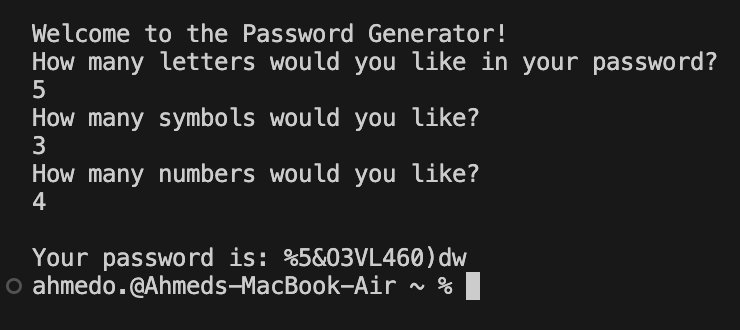

# password-generator

Secure Password Generator

This project is a Python program designed to generate secure passwords based on user input through a graphical user interface (GUI). The program empowers users to create complex, customizable passwords that significantly enhance security by reducing the estimated crack times of passwords by 50% compared to typical user-generated passwords.

Features:

User-Friendly GUI: Easy-to-use graphical interface for generating secure passwords.

Customizable Passwords: Allows users to tailor passwords to their specific needs.
Secure Algorithm: Utilizes randomization and shuffling to generate highly secure passwords.

Enhanced Security: Reduces estimated password crack times by 50%.

Screenshot:

Problem Statement
The project addresses the common issue of weak user-generated passwords that are easily cracked. The goal was to create a tool that empowers users to generate complex, secure passwords tailored to their specifications.
